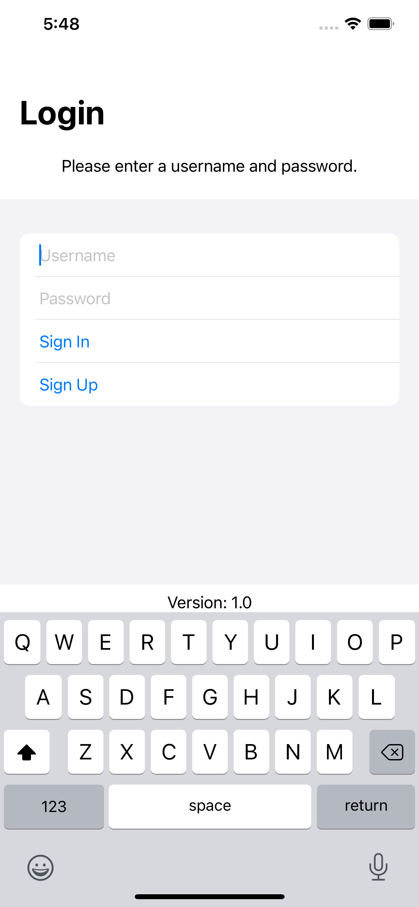
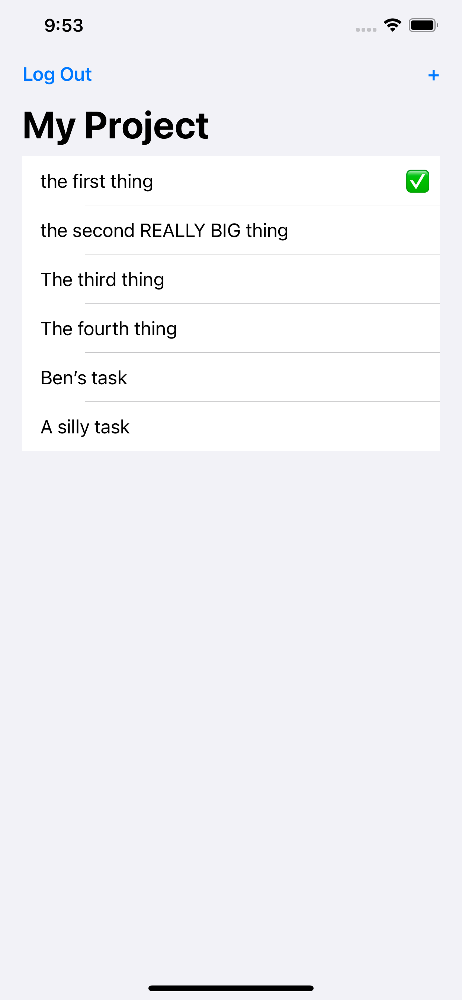

# MongoDB Realm Task Tracker

Implementation of the [MongoDB Realm iOS Swift tutorial](https://docs.mongodb.com/realm/tutorial/ios-swift/)
in SwiftUI.

## 📸 Screenshots

## 📄 License

This repo is licensed under the MIT License. See the [LICENSE](LICENSE.md) file for rights and limitations.
