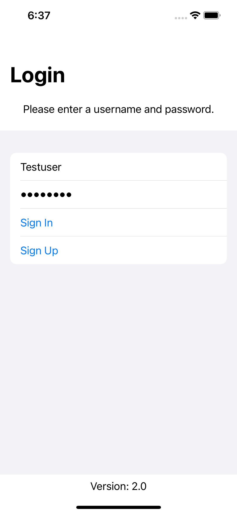

# MongoDB Realm Task Tracker

Implementation of the [MongoDB Realm iOS Swift tutorial](https://docs.mongodb.com/realm/tutorial/ios-swift/)
in SwiftUI.

v1 presented at [MongoDB.live 2021](https://app.swapcard.com/widget/event/mongodb-live-2021/planning/UGxhbm5pbmdfNDc3Nzcw).
v2 presented at [Denver Cocoaheads](https://www.meetup.com/CocoaheadsDenver/)
and (soon) at [360|iDev 2021](https://360idev.com/session/combine-ing-mongodb-realm-with-swiftui/).

## 📸 Screenshots

## 📄 License

This repo is licensed under the MIT License. See the [LICENSE](LICENSE.md) file for rights and limitations.
